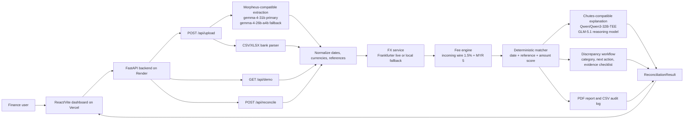
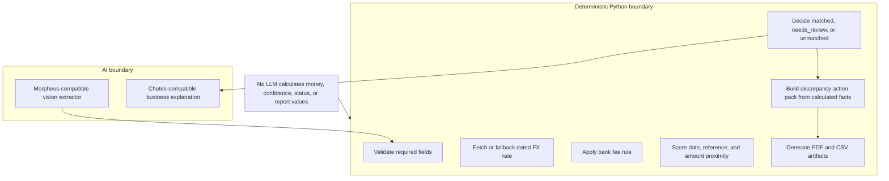
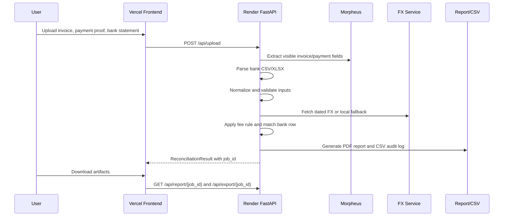

# Treasurer.ai

AI-powered cross-border reconciliation for SME finance teams, built for **AI
Marathon 2026**, Track 3: **Treasurer.ai**.

Treasurer.ai turns invoices, payment proofs, and local bank statements
into a traceable reconciliation result, discrepancy explanation, agentic action
pack, PDF report, and CSV audit log.

> Core trust rule: AI extracts and explains. Deterministic Python code calculates
> and validates all FX conversion, bank fees, match scores, statuses, and report
> values.

## Submission Readiness

This repository satisfies the preliminary submission documentation requirements:

Access directly at 

- Frontend URL: `https://global-treasury-agent.vercel.app/`
- Backend URL: `https://global-treasury-agent.onrender.com/`
- API docs: `https://global-treasury-agent.onrender.com/docs`


| Requirement | Where |
|---|---|
| System requirements and dependencies | [System Requirements](#system-requirements), [Install Dependencies](#install-dependencies) |
| Step-by-step local run instructions | [Local Quick Start](#local-quick-start) | or directly use it at https://global-treasury-agent.vercel.app/
| Working prototype endpoints | [API Reference](#api-reference) |
| Agent framework diagram | [Agent Workflow Diagram](#agent-workflow-diagram) |
| Source code explanation | [Code Explanation](#code-explanation) |
| Demo flow and expected output | [Demo Walkthrough](#demo-walkthrough) |

## Hosted Platforms

Recommended hosted deployment split:

| Surface | Platform | Service Type | Notes |
|---|---|---|---|
| Dashboard | Vercel | React/Vite static frontend | Set `VITE_API_URL` to the Render backend URL. |
| API | Render | FastAPI web service | Run from `backend/` with `uvicorn app.main:app --host 0.0.0.0 --port $PORT`. |
| Local fallback demo | Docker or local terminals | Frontend + backend | Works without provider keys or internet when `DEMO_MODE=true`. |

## System Requirements

- Python 3.9 or later.
- Node.js 18 or later and npm.
- Optional: Docker Desktop for one-command local startup.

Backend dependencies are listed in [backend/requirements.txt](backend/requirements.txt).
Frontend dependencies are listed in [frontend/package.json](frontend/package.json).

## Install Dependencies

PowerShell on Windows:

```powershell
cd backend
python -m venv .venv
.\.venv\Scripts\Activate.ps1
pip install -r requirements.txt

cd ..\frontend
npm install
```

macOS/Linux:

```bash
cd backend
python3 -m venv .venv
source .venv/bin/activate
pip install -r requirements.txt

cd ../frontend
npm install
```

## Local Quick Start

Terminal 1, backend:

```bash
cd backend
source .venv/bin/activate
uvicorn app.main:app --reload --port 8000
```

On Windows PowerShell, activate with:

```powershell
cd backend
.\.venv\Scripts\Activate.ps1
uvicorn app.main:app --reload --port 8000
```

Open backend API docs:

```text
http://localhost:8000/docs
```

Terminal 2, frontend:

```bash
cd frontend
npm run dev
```

Open the dashboard:

```text
http://localhost:5173
```

If the backend is not on `http://localhost:8000`, set:

```bash
VITE_API_URL=http://localhost:8000
```

## Docker Quick Start

```bash
docker compose up
```

Default local service URLs:

- Frontend: `http://localhost:5173`
- Backend: `http://localhost:8000`
- API docs: `http://localhost:8000/docs`

## Environment Configuration

The default `DEMO_MODE=true` keeps the application stable without API keys or
network access.

```bash
DEMO_MODE=true
CORS_ORIGINS=http://localhost:5173,http://localhost:3000
FX_API_URL=https://api.frankfurter.dev/v2
FX_API_TIMEOUT_SECONDS=3
```

Optional live provider configuration:

```bash
DEMO_MODE=false
MORPHEUS_API_KEY=
MORPHEUS_BASE_URL=https://api.mor.org/api/v1
MORPHEUS_MODEL=gemma-4-31b
MORPHEUS_FAST_MODEL=gemma-4-26b-a4b

CHUTES_API_KEY=
CHUTES_BASE_URL=https://llm.chutes.ai/v1
CHUTES_MODEL=Qwen/Qwen3-32B-TEE
CHUTES_REASONING_MODEL=zai-org/GLM-5.1-TEE
```

Hosted deployment variables:

| Service | Variable | Value |
|---|---|---|
| Vercel frontend | `VITE_API_URL` | Render backend URL |
| Render backend | `DEMO_MODE` | `true` for judged fallback demo, `false` for live provider test |
| Render backend | `CORS_ORIGINS` | Vercel frontend URL |
| Render backend | `MORPHEUS_*`, `CHUTES_*` | Optional live provider settings |

## Demo Walkthrough

1. Open the dashboard and choose the **Matched** scenario.
2. The system extracts or loads invoice `INV-2026-0412` for `USD 100.00`.
3. Stored dated FX rate `USD/MYR 4.3300` converts the invoice to `MYR 433.00`.
4. The incoming-wire fee rule applies `1.5% + MYR 5.00`, totaling `MYR 11.50`.
5. Expected bank credit is `MYR 421.50`.
6. Bank row `row_003` credits `MYR 421.50`, producing a matched result.
7. Switch to **Needs Review** to show a `MYR 418.00` credit discrepancy and a
   structured finance action pack.
8. Switch to **Unmatched** to show that the system refuses to invent a match and
   produces a missing-evidence checklist plus mock finance notification.
9. Download the generated PDF reconciliation report and CSV audit log.

Live upload sample, when `DEMO_MODE=false` and Morpheus/Frankfurter are
configured:

```bash
curl -X POST http://localhost:8000/api/upload \
  -F "invoice=@data/demo/live_fx_upload_test/invoice_INV-LIVE-2026-0526.png" \
  -F "payment_proof=@data/demo/live_fx_upload_test/payment_proof_INV-LIVE-2026-0526.png" \
  -F "bank_statement=@data/demo/live_fx_upload_test/bank_statement_live_fx.csv"
```

Expected live sample highlights:

- `status`: `matched`
- `invoice.invoice_number`: `INV-LIVE-2026-0526`
- `fx_trace.source`: `frankfurter_live`
- `fx_trace.rate`: `3.955`
- `fee_trace.expected_credit`: `968.92`
- `best_match.row_id`: `live_row_002`

Unmatched upload sample for judges, available in
[`data/demo/live_fx_upload_test_unmatched`](data/demo/live_fx_upload_test_unmatched):

```bash
curl -X POST http://localhost:8000/api/upload \
  -F "invoice=@data/demo/live_fx_upload_test_unmatched/invoice_INV-2026-0412.png" \
  -F "payment_proof=@data/demo/live_fx_upload_test_unmatched/payment_receipt_INV-2026-0412.png" \
  -F "bank_statement=@data/demo/live_fx_upload_test_unmatched/bank_statement_unmatched_live_fx.csv"
```

You can also upload those same three files through the dashboard while the app is
running. In the default `DEMO_MODE=true`, the invoice/payment extraction uses
the deterministic fallback values for `INV-2026-0412`, and the uploaded bank
statement is parsed normally. That statement intentionally omits a matching
`MYR 421.50` credit, so the expected result is:

- `status`: `unmatched`
- `invoice.invoice_number`: `INV-2026-0412`
- `fx_trace.rate`: `4.33`
- `fee_trace.expected_credit`: `421.50`
- `best_match`: unrelated low-confidence bank row

## Agentic Discrepancy Workflow

When a result is `needs_review` or `unmatched`, the backend attaches an
`action_pack` that turns the failed reconciliation into a structured workflow:

- discrepancy category
- likely reason framed as a hypothesis, not a production claim
- recommended finance-team next action
- missing evidence checklist
- mock notification message
- audit-safe explanation tied to calculated FX, fee, confidence, and score facts

Matched results return `action_pack: null`. The frontend renders the action pack
inside the discrepancy panel, while PDF and CSV artifacts remain available.

## Agent Workflow Diagram


It names the actual frontend components, FastAPI routers, backend service
modules, data contracts, generated artifacts, and AI-versus-deterministic trust
boundary.



## Trust Boundary Diagram



## API Flow Diagram



## Optional Diagram Prompts For GLM / Z.ai

Use these if you want image-based diagrams for the pitch deck. Keep the labels
faithful to the Mermaid diagrams above.

Prompt 1, architecture diagram:

```text
Create a clean finance-operations architecture diagram for an AI Marathon 2026
project named Treasurer.ai. Show this flow: User -> Vercel React/Vite
Dashboard -> Render FastAPI Backend -> Upload/Demo/Reconcile API routes ->
Morpheus-compatible extraction using gemma-4-31b primary and gemma-4-26b-a4b
fallback -> deterministic Python normalization -> Frankfurter FX service with
local fallback -> deterministic fee engine -> deterministic matcher -> Chutes
explanation boundary using Qwen/Qwen3-32B-TEE and zai-org/GLM-5.1-TEE -> PDF
report and CSV audit log -> result returned to dashboard. Visually separate AI
steps from deterministic code steps. Use green for deterministic finance logic,
purple for AI extraction/explanation, and blue for hosted infrastructure. Avoid
generic AI brain graphics. Make it readable on one 16:9 slide.
```

Prompt 2, trust boundary diagram:

```text
Create a 16:9 slide diagram titled "AI where it helps. Code where it counts."
for a treasury reconciliation product. Left side: AI boundary with Morpheus
document extraction and Chutes explanation. Right side: deterministic Python
boundary with field validation, dated FX lookup, bank fee calculation, match
scoring, status decision, PDF/CSV artifact generation. Add a bottom guardrail:
"No LLM calculates money, confidence, status, or report values." Use a
professional audit-ready finance dashboard style with restrained colors.
```

Prompt 3, demo calculation diagram:

```text
Design a 16:9 calculation trace slide for invoice INV-2026-0412. Show USD
100.00 multiplied by USD/MYR 4.3300 equals MYR 433.00. Then show incoming wire
fee equals 1.5% plus MYR 5.00, total MYR 11.50. Then show expected bank credit
MYR 421.50 and actual bank credit MYR 421.50 with matched status. Use a
ledger/audit-trace visual style, not a marketing hero page. Highlight that all
money math is deterministic code.
```

## API Reference

| Method | Route | Purpose |
|---|---|---|
| GET | `/api/health` | Backend status and active mode |
| GET | `/api/demo` | Offline matched golden-path reconciliation |
| GET | `/api/demo?case=matched\|needs_review\|unmatched` | Deterministic scenario selection |
| POST | `/api/upload` | Upload invoice, payment proof, and CSV/XLSX bank statement |
| POST | `/api/reconcile` | Reconcile structured inputs or a stored upload `job_id` |
| GET | `/api/report/{job_id}` | Download generated PDF report |
| GET | `/api/export/{job_id}` | Download generated CSV audit log |

Shared response shape:

```json
{
  "job_id": "demo_001",
  "status": "matched",
  "confidence": 1.0,
  "invoice": {},
  "payment": {},
  "best_match": {},
  "fx_trace": {},
  "fee_trace": {},
  "score_breakdown": {},
  "explanation": "",
  "action_pack": null,
  "warnings": []
}
```

For `needs_review` and `unmatched` results, `action_pack` contains a
deterministic next-step package:

```json
{
  "category": "amount_variance_after_fx_and_fees",
  "likely_reason": "",
  "recommended_next_action": "",
  "missing_evidence_checklist": [],
  "mock_notification_message": "",
  "audit_safe_explanation": "",
  "evidence_basis": []
}
```

The action pack is built only from extracted fields, FX trace, fee trace, match
scores, and selected bank-row facts. It does not calculate money with an LLM or
claim unobserved bank charges as facts.

Smoke-test commands:

```bash
curl http://localhost:8000/api/health
curl "http://localhost:8000/api/demo?case=matched"
curl "http://localhost:8000/api/demo?case=needs_review"
curl "http://localhost:8000/api/demo?case=unmatched"
```

Multipart upload in demo mode:

```bash
curl -X POST http://localhost:8000/api/upload \
  -F "invoice=@data/demo/sample_invoice.pdf" \
  -F "payment_proof=@data/demo/sample_payment_proof.pdf" \
  -F "bank_statement=@data/demo/sample_bank_statement.csv"
```

Then reconcile a stored upload result:

```bash
curl -X POST http://localhost:8000/api/reconcile \
  -H "Content-Type: application/json" \
  -d "{\"job_id\":\"upload_job_id_here\"}"
```

## Code Explanation

Backend entrypoint:

- [backend/app/main.py](backend/app/main.py) creates the FastAPI app, configures
  CORS, loads environment variables, and mounts the API routers.

Shared contracts:

- [backend/app/models/schemas.py](backend/app/models/schemas.py) defines
  `InvoiceData`, `PaymentProofData`, `BankStatementRow`, `FXTrace`, `FeeTrace`,
  `MatchResult`, `DiscrepancyActionPack`, `ReconcileRequest`, and
  `ReconciliationResult`.

Routes:

- [backend/app/routers/health.py](backend/app/routers/health.py) exposes service
  readiness.
- [backend/app/routers/demo.py](backend/app/routers/demo.py) exposes deterministic
  `matched`, `needs_review`, and `unmatched` cases.
- [backend/app/routers/upload.py](backend/app/routers/upload.py) saves uploaded
  documents, extracts invoice/payment fields, parses bank rows, and submits a
  typed reconciliation request.
- [backend/app/routers/reconcile.py](backend/app/routers/reconcile.py) executes
  the shared pipeline and stores job results for report/export download.
- [backend/app/routers/report.py](backend/app/routers/report.py) serves generated
  PDF reports and CSV audit logs.

Services:

- [backend/app/services/morpheus_extractor.py](backend/app/services/morpheus_extractor.py)
  wraps Morpheus-compatible document extraction and accepts fenced JSON returned
  by providers.
- [backend/app/services/bank_statement_parser.py](backend/app/services/bank_statement_parser.py)
  normalizes CSV/XLSX bank exports into `BankStatementRow` values.
- [backend/app/services/fx_service.py](backend/app/services/fx_service.py) fetches
  dated Frankfurter rates in live mode and uses local JSON fallback in demo mode.
- [backend/app/services/fee_engine.py](backend/app/services/fee_engine.py) applies
  deterministic fee policies such as `incoming_wire`.
- [backend/app/services/matcher.py](backend/app/services/matcher.py) scores bank
  candidates with date, reference, and amount proximity.
- [backend/app/services/chutes_agent.py](backend/app/services/chutes_agent.py)
  produces explanations only from already-calculated facts.
- [backend/app/services/discrepancy_workflow.py](backend/app/services/discrepancy_workflow.py)
  builds review/unmatched action packs from calculated facts and match scores.
- [backend/app/services/report_generator.py](backend/app/services/report_generator.py)
  creates PDF reconciliation reports.
- [backend/app/services/audit_exporter.py](backend/app/services/audit_exporter.py)
  creates CSV audit logs.

Frontend:

- [frontend/src/App.jsx](frontend/src/App.jsx) renders the main dashboard,
  scenario selector, upload flow, timeline, result panels, and theme toggle.
- [frontend/src/lib/api.js](frontend/src/lib/api.js) centralizes calls to the
  FastAPI backend.
- [frontend/src/components](frontend/src/components) contains the reusable UI
  cards for uploads, timeline, extracted fields, FX/fee traces, match details,
  discrepancy handling, and artifact downloads.

## Project Structure

```text
Treasurer.ai/
|-- backend/
|   |-- app/
|   |   |-- main.py
|   |   |-- models/schemas.py
|   |   |-- routers/
|   |   |-- services/
|   |   `-- utils/
|   |-- tests/
|   `-- requirements.txt
|-- frontend/
|   |-- src/components/
|   |-- src/lib/
|   |-- src/App.jsx
|   `-- package.json
|-- data/
|   |-- demo/
|   `-- outputs/
|-- docker-compose.yml
`-- README.md
```

## Testing And Verification

Backend tests:

```bash
cd backend
source .venv/bin/activate
pytest
```

Frontend build:

```bash
cd frontend
npm run build
```

Postman smoke tests:

- Optional local Postman collections can be kept under ignored `docs/` material.
- Run smoke requests against `http://localhost:8000` with `DEMO_MODE=true`.

## Fallback And Safety Strategy

The demo does not require external network access:

- `fallback_extracted_invoice.json` replaces unavailable invoice extraction.
- `fallback_extracted_payment.json` replaces unavailable payment proof extraction.
- `fallback_fx_rates.json` replaces unavailable live dated FX lookup.
- `demo_cases.json` supplies deterministic matched, needs-review, and unmatched
  scenarios.
- `demo_results.json` is an emergency complete response if a demo-only pipeline
  service is unavailable.

For explicitly uploaded real financial inputs, the backend does not fabricate a
successful match. In live mode, if Morpheus extraction cannot safely produce
typed invoice/payment fields, `/api/upload` returns a clear `422` response.

## Known Limitations

- Demo scenarios are synthetic treasury test transactions, created for safe
  public judging.
- Batch reconciliation and persistent database storage are future work.
- Accounting integrations such as QuickBooks or Xero are planned extensions, not
  current production features.
- Chutes live calls are represented through a compatible explanation boundary;
  demo mode uses deterministic explanation text.
- Bank statement uploads support CSV/XLSX formats with common column names.

## Team

| Role | Member | Primary Ownership |
|---|---|---|
| Role 1 | Hemdan | Backend orchestration, Morpheus/Chutes wrappers, schemas |
| Role 2 | Tawila | FX, fees, matching, bank parser, reports, tests |
| Role 3 | Youssef | React dashboard, scenario selector, upload UI |
| Role 4 | Shafey | Demo script, deck, screenshots, QA |

## Future Improvements

- Multi-invoice batch reconciliation.
- Persistent job storage and history.
- Configurable treasury fee policies per bank/region.
- Human approval workflow with role-based access.
- Accounting system integrations.
- Secure document storage and audit retention.
